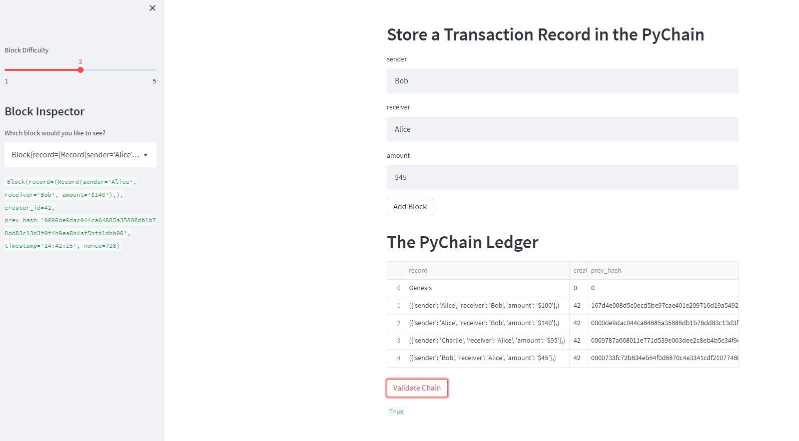

# unit18_homework

#### To use pychain.py firstly install streamlit with the following command: pip install streamlit 
#### Then run the following in terminal in the file location: streamlit run pychain.py
#### Blocks can be added by entering a sender, receiver and amount then clicking add block
#### The diffculty of mining a block can be changed by moving the difficulty slider
#### Each block can be inspected by selecting a block in the block inspector dropdown
#### Lastly the hashes of chain can be validated by clicking validate chain

